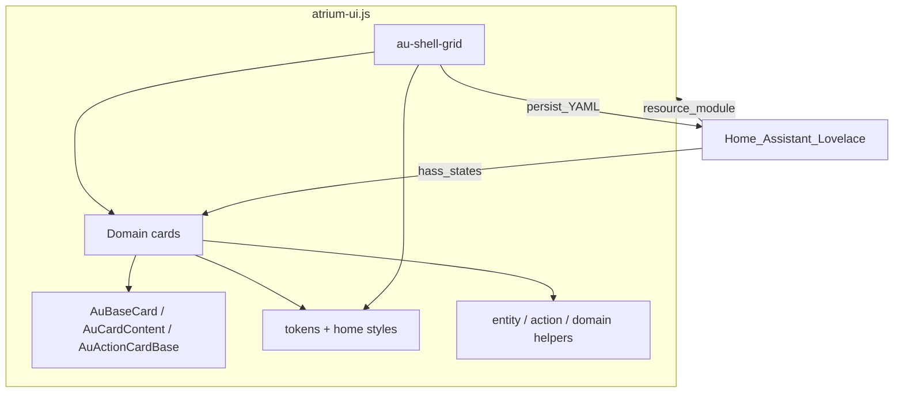

# AtriumUI — Architecture Specification

| Field | Value |
| --- | --- |
| Document type | Architecture specification (not a product PRD) |
| Status | Draft — distilled from README + codebase |
| Purpose | Define how AtriumUI **must** be structured and behave at runtime |
| Out of scope | Per-card UX copy, visual polish backlog, implementation schedule |
| Product index | [`PRD.md`](./PRD.md) |

---

## 0. Locked constraints (inputs)

| # | Constraint |
| --- | --- |
| C1 | Single self-contained ES module (`dist/atrium-ui.js`), tree-shaken, HACS/manual Lovelace resource |
| C2 | Framework: **Lit** (LitElement) + TypeScript strict mode + Vite |
| C3 | Target Home Assistant **2024.1+** (calendar events: **2023.12+**) |
| C4 | Cards behave like native HA cards: `setConfig`, entity-driven updates, visual editor, teardown |
| C5 | Grid-fill contract: card host + `.au-card` fill 100% of shell-allocated `layout: { w, h }` |
| C6 | One shell card: `custom:au-shell-grid` for classic grid **and** Home → Rooms (`floors`) |
| C7 | Do not destroy healthy reuse: `AuActionCardBase`, `AuBaseEditor`, `CARDS` registry, `resolveDomainControl`, `home-edit-commit`, classic grid compat |
| C8 | Design tokens in `src/theme/tokens.ts` are the visual source of truth (Home look) |
| C9 | Localization: en / ru / he (RTL); language follows `hass.language` |
| C10 | Action execution (`executeAction`) must validate services/urls/navigate before calling HA |
| C11 | No always-on timers for idle domains; arm tickers only when needed |
| C12 | Production quality bar (not a throwaway POC); sole-developer maintainability |

**Stack defaults:**

- UI: Lit 3 custom elements registered as Lovelace cards
- Bundle: Vite → one optimized chunk
- Tests: Vitest under `test/**/*.test.ts`
- Tooling: `tsc --noEmit`, ESLint, Prettier

---

## 1. Architectural principle

AtriumUI is a **Lovelace design system**: one bundle, shared bases, domain cards, and a dashboard shell that owns layout persistence.



---

## 2. Actors and components

| Component | Must do |
| --- | --- |
| **`au-shell-grid`** | Host classic child grid or Home floors/rooms; edit mode drag/resize/add; persist layout to Lovelace config |
| **Domain cards** | Validate config; bind entities; render controls; expose editors |
| **`AuBaseCard`** | Lovelace card lifecycle + hass wiring |
| **`AuCardContent`** | Grid-fill surface contract |
| **`AuActionCardBase`** | Entity binding, optional display slots, tap/hold/double-tap actions |
| **`AuBaseEditor`** | Shared visual editor scaffolding |
| **`CARDS` registry** | Card type registration / stubs for pickers |
| **Theme tokens** | Home look CSS variables |
| **Localize** | String catalogs for en/ru/he |

---

## 3. Repository layers

```text
src/
  template/shell-grid/   # dashboard shell (classic + Home)
  card/                  # Lovelace cards per domain
  components/            # reusable UI primitives (sliders, chips, steppers)
  core/                  # base-card, card-content, action-card, base-editor
  localize/              # en / ru / he
  theme/                 # tokens, home styles, tile layout
  types/                 # HA + Atrium config types
  utils/                 # entity, action, domain helpers
test/                    # Vitest mirrors src/
demo/                    # sample Lovelace YAML
```

Layering rules:

- Cards may import `core/`, `components/`, `theme/`, `utils/`, `localize/`, `types/`
- Shell may create child cards and persist config; domain remapping uses the entity→card table
- Avoid new cross-card god objects; prefer shared utils over duplicating gestures/pending-control

---

## 4. Card contract (MUST)

Every Atrium card MUST:

1. Validate YAML in `setConfig` (reject invalid configs with clear errors)
2. Update only when tracked entities / relevant hass slices change
3. Expose `getConfigElement()` when a visual editor exists
4. Tear down listeners, timers, and overlays in `disconnectedCallback`
5. Fill the shell cell via `AuCardContent` / grid-fill styles

Action defaults (when omitted): tap = `toggle` (fallback more-info if not toggleable); hold and double-tap = `more-info`.

---

## 5. Shell modes

| Mode | Trigger | Behavior |
| --- | --- | --- |
| Classic grid | No `floors` (or classic `cards` layout) | Coordinate grid of child Lovelace cards |
| Home → Rooms | `floors` configured | Home overview room tiles + in-room entity grids; `variant: home` on entity tiles |

Shared grid options: `columns`, `row_height`, `gap`, `rows`, `height`, `editable`. Responsive columns: 12 desktop / 6 tablet / 1 mobile. Drag/resize desktop-only.

Persistence: storage-mode dashboards; stable child `id` recommended. Home migrate: former `au-home-dashboard` keys live on `au-shell-grid`.

---

## 6. Domain → card mapping (Home)

| Domain | Card |
| --- | --- |
| `light` | `au-light-card` |
| `climate` | `au-climate-card` |
| `fan` | `au-fan-card` |
| `cover` | `au-cover-card` |
| `switch` | `au-switch-card` |
| `vacuum` | `au-vacuum-card` |
| `sensor` / `binary_sensor` | `au-sensor-card` |
| `water_heater`, … | `au-device-card` |
| other toggleable | `au-action-card` (or device when supported) |

`card_type_locked: true` preserves intentional mismatches. Calendar, room, shell-grid, and third-party cards are never remapped.

---

## 7. Security & runtime hygiene

1. `executeAction` MUST validate `call-service` / `url` / `navigate` before invoking HA or navigation.
2. Device/water-heater timers MUST NOT run `setInterval` when idle/unarmed.
3. Confirm high-stakes bulk actions when `confirm_actions` is enabled.

---

## 8. Build & verification surface

| Command | Purpose |
| --- | --- |
| `npm run typecheck` | Strict TS |
| `npm run lint` | ESLint `src` + `test` |
| `npm test` | Vitest |
| `npm run build` | `dist/atrium-ui.js` + declarations |
| `npm run verify` | typecheck + lint + test + build |
| `npm run dev:ha` | Watch-build into HA `www` |

Knowledge graph: `graphify-out/`; use `graphify query` before deep exploration; `graphify update .` after code changes.

---

## 9. Architecture acceptance criteria

1. Single HACS-loadable module registers all documented custom elements.
2. Shell supports classic and Home modes without a nested home card type.
3. All domain cards satisfy §4 card contract.
4. Tokens in `src/theme/tokens.ts` drive Home visuals; README docs match tokens.
5. Healthy reuse listed in C7 remains the extension path for new cards/editors.
6. Automated `npm run verify` passes on `main`.

---

## 10. Document control

| Version | Notes |
| --- | --- |
| 0.1 | Initial architecture capture from README + MASTER_ASSESSMENT |
