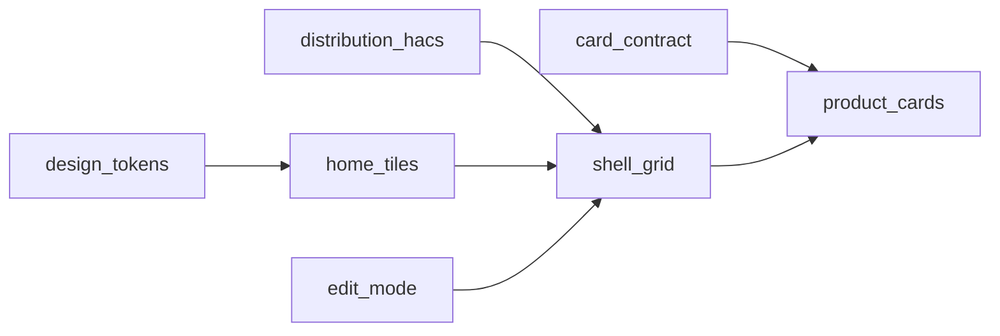

# Phase 0 — Shipped spine (summary)

| Field | Value |
| --- | --- |
| Phase | **0** — Shipped spine |
| Status | **Complete** for the core library on `main` (per [PRD §6](./PRD.md#6-implementation-phases)); assessment follow-ups are Phases 1–4 |
| Milestone intent | Installable AtriumUI module; shell (classic + Home); domain cards; editors; tests |
| Shipped on | `main` |

This document summarizes what Phase 0 delivered. Authoritative requirements stay in the linked PRD/architecture/ops files; implementation notes live under [`docs/imp/feature/`](./imp/feature/).

---

## 1. Goal

Ship a production Lovelace design system: one ES module, `au-shell-grid` for classic and Home → Rooms, domain cards with native editors, Home look tokens, and a Vitest suite.

Exit when ([PRD §6](./PRD.md#6-implementation-phases)):

- HACS/manual resource loads `atrium-ui.js`
- Classic grid + Home `floors` modes work
- Documented domain cards register and satisfy the card contract
- `npm run verify` (or typecheck/lint/test/build) passes

---

## 2. Architecture anchors

| Topic | Where |
| --- | --- |
| Stack, layers, card contract | [ARCHITECTURE.md](./ARCHITECTURE.md) §0–§4 |
| Shell modes + domain map | [ARCHITECTURE.md](./ARCHITECTURE.md) §5–§6 |
| Tokens | [prd/ux/design-system.md](./prd/ux/design-system.md) |
| Product scope vs wishlist | [PRD.md](./PRD.md) wins over [SCOPE_AND_FEATURES.md](./SCOPE_AND_FEATURES.md) |

---

## 3. Feature map

| # | Feature | Spec | Implementation record |
| --- | --- | --- | --- |
| 1 | Shell grid | [prd/platform/shell-grid.md](./prd/platform/shell-grid.md) | [imp/feature/room-idle-timeout.md](./imp/feature/room-idle-timeout.md) (idle slice) |
| 2 | Card contract | [prd/platform/card-contract.md](./prd/platform/card-contract.md) | — (baseline on `main`) |
| 3 | Distribution & HACS | [prd/platform/distribution-hacs.md](./prd/platform/distribution-hacs.md) | — |
| 4 | Domain cards | [prd/product/*](./prd/product/) | — |
| 5 | Home tiles / edit / localize / tokens | [prd/ux/*](./prd/ux/) | — |

---

## 4. What shipped (high level)

- `custom:au-shell-grid` classic + Home (`floors`, presence, room controls, domain remapping)
- Cards: action, sensor, light, climate, fan, cover, switch, vacuum, device, room, calendar
- Shared bases: `AuBaseCard`, `AuCardContent`, `AuActionCardBase`, `AuBaseEditor`
- Tokens + localize en/ru/he
- Vitest suite under `test/`
- Room idle timeout (`room_idle_timeout`) returning to Home — see imp record

---

## 5. Explicitly not Phase 0 exit blockers

Assessment items tracked in PRD Phases 1–4 (sensor Home variant, token drift cleanup, action hardening, device timer arming, shell carve-up, etc.).

---

## 6. Document control

| Version | Notes |
| --- | --- |
| 0.1 | Phase 0 summary for AtriumUI shipped spine |
