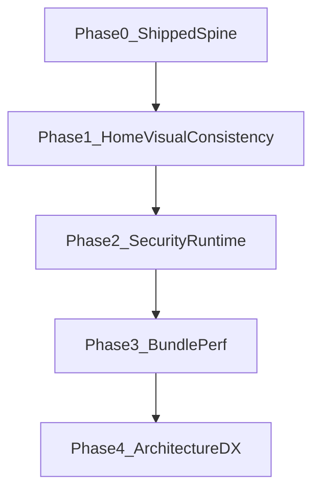

# AtriumUI — Product Requirements Index

| Field | Value |
| --- | --- |
| Product | **AtriumUI** |
| Document type | PRD index (feature specs live under [`prd/`](./prd/)) |
| Status | Draft — distilled from README + MASTER_ASSESSMENT |
| Architecture | [`ARCHITECTURE.md`](./ARCHITECTURE.md) — MUST obey |
| Legacy scope | [`SCOPE_AND_FEATURES.md`](./SCOPE_AND_FEATURES.md) — wishlist; **PRD wins** on conflicts |
| Platforms (v1) | Home Assistant Lovelace (Panel views; HACS or manual resource) |
| Languages | English, Russian, Hebrew (RTL); follows `hass.language` |
| Spec language | English docs |

This file is the **index**. Implementation detail for each capability is in an individual feature file. Product Scope for the current line is complete only when every **MUST** feature file’s acceptance criteria pass, plus Architecture §9. Engineering **build order** is defined in [§6 Implementation phases](#6-implementation-phases).

---

## 1. Vision

AtriumUI is a **production-grade custom component library and structural design system** for the Home Assistant frontend (Lovelace). It ships as a single, self-contained, tree-shaken ES module so households can compose unified dashboards without mixed dependencies from separate custom cards.

### Who it is for
- Sole developer / household dashboard authors
- Users who want Apple Home–like Home → Rooms **or** a classic drag/resize card grid
- HACS or manual Lovelace resource installers

### Primary job
**Unified Lovelace UI**: one shell, consistent Home look tokens, and domain cards that feel native.

---

## 2. Success criteria

1. All documented cards and `au-shell-grid` (classic + Home) satisfy their feature acceptance criteria.
2. Architecture acceptance criteria hold ([`ARCHITECTURE.md`](./ARCHITECTURE.md) §9).
3. Home visual language is consistent (tokens, sensors, edit chrome) — no Material/Home drift.
4. `npm run verify` stays green on `main`.
5. Healthy reuse (`AuActionCardBase`, `AuBaseEditor`, `CARDS`, `resolveDomainControl`, `home-edit-commit`, classic grid compat) remains intact.

---

## 3. Decision log (from README + assessment)

| # | Topic | Decision |
| --- | --- | --- |
| D1 | Distribution | Single `atrium-ui.js` chunk; HACS Dashboard + manual resource |
| D2 | Shell | One card `au-shell-grid` for classic grid and Home → Rooms (`floors`) |
| D3 | Visual language | Home look; `src/theme/tokens.ts` is source of truth (accent `#0a84ff`) |
| D4 | Card tags | Post-v0.1.0: `au-*-card` naming; `au-action-tile` / `au-sensor-readout` retired |
| D5 | Actions | HA-native `tap_action` / `hold_action` / `double_tap_action`; defaults toggle / more-info / more-info |
| D6 | Grid-fill | Cards always fill shell `layout: { w, h }` via `AuCardContent` |
| D7 | Priority order | UI/UX consistency → security → bundle/perf → architecture/DX |
| D8 | Reuse | Do not destroy `AuActionCardBase`, registry, domain control, home-edit-commit, classic compat |
| D9 | Sensor Home | Sensor card MUST support Home `variant` / tile path |
| D10 | Action safety | `executeAction` MUST validate services/urls/navigate |
| D11 | Timers | Device card tickers only when armed |
| D12 | i18n | en / ru / he catalogs; no extra locales in current scope |
| D13 | PRD structure | `PRD.md` index + one full-spec file per feature (platform/product/ux) |
| D14 | Breaking changes | Allowed for sole-dev project when docs + migration notes update |

---

## 4. Architecture obedience (summary)

AtriumUI MUST obey [`ARCHITECTURE.md`](./ARCHITECTURE.md):

- Lit + TypeScript + Vite single chunk
- Native Lovelace card contract
- One shell for classic + Home
- Token-driven Home look
- Validated actions; no idle always-on timers
- Preserve healthy reuse paths

Feature specs must not invent a second shell card or parallel design-token system.

---

## 5. Non-goals / parked

| Parked / out | Notes |
| --- | --- |
| Cloud card marketplace / multi-bundle deps | Out — single module |
| Nested `au-home-dashboard` card | Removed; keys on `au-shell-grid` |
| Climate humidity targeting, swing, dual heat_cool setpoints | Out of climate v1 |
| Direct Google/Apple calendar APIs | Out — HA `calendar.*` only |
| Fan/cover/switch/vacuum on device-card | Out — use dedicated cards |
| WAN remote HA as Atrium concern | Out — HA networking |

---

## 6. Implementation phases

Phases are **engineering build order**, derived from MASTER_ASSESSMENT steps. They do not shrink the MUST feature set for shipped cards already on `main`.

| Phase | Name | Feature focus | Milestone intent |
| --- | --- | --- | --- |
| **0** | Shipped spine ([summary](./PHASE_0.md)) | platform + product cards + baseline ux | Library usable: shell, cards, HACS, tests |
| **1** | Home visual consistency | [design-system](./prd/ux/design-system.md), [home-tiles](./prd/ux/home-tiles.md), [sensor-card](./prd/product/sensor-card.md) Home variant | One Home language (tokens, sensors, chrome) |
| **2** | Security & runtime | [card-contract](./prd/platform/card-contract.md) action validation; device timers | Trusted `executeAction`; no idle tickers |
| **3** | Bundle & perf | shared gestures/pending-control; dead code | Leaner chunk; clearer idle cost |
| **4** | Architecture & DX | [edit-mode](./prd/ux/edit-mode.md), shell carve-up, ESLint/docs discipline | Thinner Home view; draft discipline; verify CI |

### Exit criteria (phase complete)

| Phase | Exit when |
| --- | --- |
| **0** | Documented cards + shell ACs pass; `npm run verify` green; Phase 0 summary accurate |
| **1** | Tokens/README aligned; sensor Home variant; edit chrome uses Home accent (**met** — 2026-08-01 reconcile) |
| **2** | Action validation ACs pass; device timer only when armed (**met** — 2026-08-01 reconcile) |
| **3** | Shared gesture/pending-control path; orphan dead code removed per assessment |
| **4** | Edit draft discipline; shell maintainability improvements; CI + docs workflow stable |

---

## 7. Feature catalog

Use [`prd/_TEMPLATE.md`](./prd/_TEMPLATE.md) for new files. For build order, see [§6](#6-implementation-phases).

### 7.1 Platform

| Feature | Purpose |
| --- | --- |
| [Shell grid](./prd/platform/shell-grid.md) | Classic grid + Home → Rooms; layout persist |
| [Card contract](./prd/platform/card-contract.md) | Native Lovelace lifecycle, grid-fill, actions |
| [Distribution & HACS](./prd/platform/distribution-hacs.md) | Single chunk resource; `dev:ha` |

### 7.2 Product

| Feature | Purpose |
| --- | --- |
| [Action card](./prd/product/action-card.md) | Generic toggle tile + actions |
| [Sensor card](./prd/product/sensor-card.md) | Gauge + severity; Home variant |
| [Light card](./prd/product/light-card.md) | Capability-driven light controls |
| [Climate card](./prd/product/climate-card.md) | HVAC / temp / fan modes |
| [Fan card](./prd/product/fan-card.md) | Speed, presets, oscillate, direction |
| [Cover card](./prd/product/cover-card.md) | Open/close/stop + position |
| [Switch card](./prd/product/switch-card.md) | Explicit on/off switch tile |
| [Vacuum card](./prd/product/vacuum-card.md) | Clean controls + settings overlay |
| [Device card](./prd/product/device-card.md) | Adaptive multi-domain tile |
| [Room card](./prd/product/room-card.md) | Icon-button light/switch row |
| [Calendar card](./prd/product/calendar-card.md) | View-only calendar preview |

### 7.3 UX / cross-cutting

| Feature | Purpose |
| --- | --- |
| [Home tiles](./prd/ux/home-tiles.md) | Home variant visual language |
| [Edit mode](./prd/ux/edit-mode.md) | Drag/resize/add, drafts, picker |
| [Localize](./prd/ux/localize.md) | en / ru / he strings |
| [Design tokens](./prd/ux/design-system.md) | Token source of truth |

---

## 8. Global acceptance checklist

- [ ] Architecture §9 criteria satisfied
- [ ] Phases 0–4 exit criteria met for their MUST slices (0–2 met; 3–4 open)
- [ ] Every MUST feature file §7 AC list checked
- [x] Home look consistent (tokens, sensors, edit chrome)
- [x] `executeAction` validated
- [x] Device timers not always-on
- [ ] Classic + Home shell modes both usable
- [ ] `npm run verify` green

---

## 9. Document control

| Version | Notes |
| --- | --- |
| 0.1 | PRD index from README + MASTER_ASSESSMENT; Zerem-shaped feature split |
| 0.2 | Phase 1–2 exits marked met; design-tokens PRD path → `prd/ux/design-system.md` |
